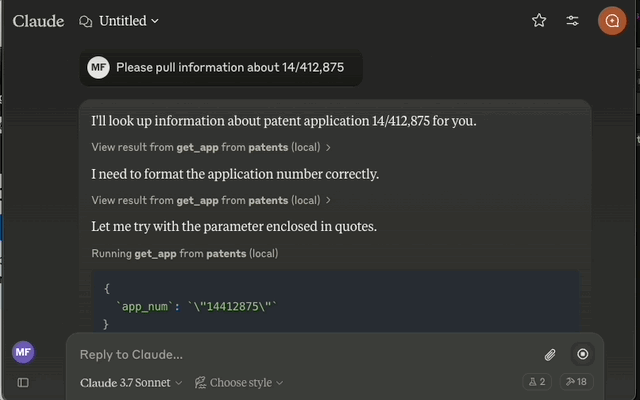

# USPTO Patent MCP Server

A [FastMCP server](https://github.com/modelcontextprotocol/python-sdk/tree/main/src/mcp/server/fastmcp) for accessing United States Patent and Trademark Office (USPTO) patent and patent application data through multiple APIs including the [Patent Public Search](https://www.uspto.gov/patents/search/patent-public-search) API, the [Open Data Portal (ODP) API](https://data.uspto.gov/home), [PTAB API v3](https://developer.uspto.gov/api-catalog), [PatentsView API](https://patentsview.org/apis/purpose), Office Action APIs, and Patent Litigation APIs. Using this server, Claude Desktop can pull data from USPTO APIs, search through PTAB proceedings and decisions, analyze patent litigation, research prosecution history, and more:



For an introduction to MCP servers see [Introducing the Model Context Protocol](https://www.anthropic.com/news/model-context-protocol).

Special thanks to [Parker Hancock](https://github.com/parkerhancock), author of the amazing [Patent Client project](https://github.com/parkerhancock/patent_client), for [blazing the trail](https://github.com/parkerhancock/patent_client/issues/63) to understanding of the string of requests and responses needed to pull data through the Public Search API.

## Features

This server provides **50+ tools** across 6 USPTO data sources for:

1. **Patent Search** - Full-text search of granted patents and published applications via PPUBS and PatentsView
2. **Full Text Documents** - Get complete text of patents including claims, description, and specification
3. **PDF Downloads** - Download patents as PDF files (Claude Desktop doesn't support this as a client currently)
4. **Prosecution History** - Access office actions, transactions, and file wrapper data
5. **PTAB Proceedings** - Search and retrieve Patent Trial and Appeal Board proceedings (IPR, PGR, CBM), decisions, and appeals
6. **Office Actions** - Access full-text office actions, citations, and rejection data
7. **Patent Litigation** - Search 74,000+ district court patent cases
8. **Citation Analysis** - Get enriched citation data and metrics
9. **Patent Family Data** - Continuity information, foreign priority, and related applications
10. **Inventor/Assignee Search** - Disambiguated inventor and assignee data via PatentsView

## API Sources

This server interacts with six USPTO patent data sources:

| Source | Description | Auth Required |
|--------|-------------|---------------|
| **ppubs.uspto.gov** | Full text documents, PDF downloads, advanced search (daily updates) | No |
| **api.uspto.gov (ODP)** | Metadata, continuity, transactions, assignments, prosecution history | Yes (USPTO API Key) |
| **PTAB API v3** | IPR/PGR/CBM proceedings, decisions, appeals, interferences | Yes (USPTO API Key) |
| **PatentsView API** | Disambiguated inventor/assignee data, advanced search | Yes (PatentsView Key) |
| **Office Action APIs** | Full-text office actions, citations, rejections (12-series apps, June 2018+) | Yes (USPTO API Key) |
| **Patent Litigation API** | 74,000+ district court patent cases | Yes (USPTO API Key) |

## Prerequisites

- **Python 3.10-3.13** (3.12 recommended)
- **Claude Desktop** (for integration). Other models and MCP clients have not been tested.
- **[UV](https://docs.astral.sh/uv/)** for Python version and dependency management

If you're a Python developer but still unfamiliar with uv, you're in for a treat. It's faster and easier than having a separate Python version manager (like pyenv) and setting up, activating, and maintaining virtual environments with venv and pip.

If you don't already have uv installed:
```bash
curl -LsSf https://astral.sh/uv/install.sh | sh
```

## Installation

1. Clone this repository:
   ```bash
   git clone https://github.com/riemannzeta/patent_mcp_server
   cd patent_mcp_server
   ```

2. Install dependencies with uv:
   ```bash
   uv sync
   ```

3. Verify installation:
   ```bash
   uv run patent-mcp-server
   ```
   Should output:
   ```
   INFO     Starting USPTO Patent MCP server with stdio transport
   ```

## API Key Setup

### USPTO API Key (Required for most tools)

To use the api.uspto.gov tools (ODP, PTAB, Office Actions, Litigation), you need an Open Data Portal API key:

1. Visit [USPTO's Getting Started page](https://data.uspto.gov/apis/getting-started) and follow the instructions to request an API key.

2. Create a `.env` file in the patent_mcp_server directory:
   ```bash
   USPTO_API_KEY=your_actual_key_here
   ```
   Note: The PPUBS tools will work without this API key.

### PatentsView API Key (Optional)

For advanced search with disambiguated inventor/assignee data:

1. Request an API key at [PatentsView Support](https://patentsview-support.atlassian.net)

2. Add to your `.env` file:
   ```bash
   PATENTSVIEW_API_KEY=your_patentsview_key
   ```

## Configuration

The server can be configured using environment variables in your `.env` file. All settings are optional with sensible defaults:

```bash
# API Keys
USPTO_API_KEY=your_key_here
PATENTSVIEW_API_KEY=your_patentsview_key  # Optional

# Logging
LOG_LEVEL=INFO  # Options: DEBUG, INFO, WARNING, ERROR, CRITICAL

# HTTP Settings
REQUEST_TIMEOUT=30.0  # Request timeout in seconds
MAX_RETRIES=3         # Maximum number of retry attempts
RETRY_MIN_WAIT=2      # Minimum wait time between retries (seconds)
RETRY_MAX_WAIT=10     # Maximum wait time between retries (seconds)

# Session Management
SESSION_EXPIRY_MINUTES=30  # How long to cache ppubs sessions
ENABLE_CACHING=true        # Enable/disable session caching

# API Endpoints (usually don't need to change)
PPUBS_BASE_URL=https://ppubs.uspto.gov
API_BASE_URL=https://api.uspto.gov
PATENTSVIEW_BASE_URL=https://search.patentsview.org
OFFICE_ACTION_BASE_URL=https://developer.uspto.gov
```

## Claude Desktop Configuration

To integrate this MCP server with Claude Desktop:

1. Update your Claude Desktop configuration file (`claude_desktop_config.json`):
   ```json
   {
     "mcpServers": {
       "patents": {
         "command": "uv",
         "args": [
           "--directory",
           "/Users/username/patent_mcp_server",
           "run",
           "patent-mcp-server"
         ]
       }
     }
   }
   ```

   You can find `claude_desktop_config.json` on a Mac by opening the Claude Desktop app, opening Settings (from the Claude menu or by Command + ' on the keyboard), clicking "Developer" in the sidebar, and "Edit Config."

2. Replace `/Users/username/patent_mcp_server` with the actual path to your patent_mcp_server directory.

When integrated with Claude Desktop, the server will be automatically started when needed and doesn't need to be run separately.

## Available Tools

### Patent Public Search (ppubs.uspto.gov)
| Tool | Description |
|------|-------------|
| `ppubs_search_patents` | Search granted patents (full-text, daily updates) |
| `ppubs_search_applications` | Search published patent applications |
| `ppubs_get_full_document` | Get full patent document by GUID |
| `ppubs_get_patent_by_number` | Get patent's full text by number |
| `ppubs_download_patent_pdf` | Download patent as PDF |

### Open Data Portal (api.uspto.gov)
| Tool | Description |
|------|-------------|
| `odp_get_application` | Get basic application data |
| `odp_search_applications` | Search applications with filters |
| `odp_get_application_metadata` | Get comprehensive metadata |
| `odp_get_continuity` | Get patent family/continuity data |
| `odp_get_assignment` | Get ownership/assignment records |
| `odp_get_adjustment` | Get patent term adjustment data |
| `odp_get_attorney` | Get attorney/agent of record |
| `odp_get_foreign_priority` | Get foreign priority claims |
| `odp_get_transactions` | Get prosecution transaction history |
| `odp_get_documents` | Get file wrapper documents |
| `odp_search_datasets` | Search bulk data products |
| `odp_get_dataset` | Get dataset product details |
| `get_status_code` | Look up status code meaning |

### PTAB API v3 (Patent Trial and Appeal Board)
| Tool | Description |
|------|-------------|
| `ptab_search_proceedings` | Search IPR/PGR/CBM proceedings |
| `ptab_get_proceeding` | Get proceeding details |
| `ptab_get_documents` | Get documents filed in proceeding |
| `ptab_search_decisions` | Search trial decisions |
| `ptab_get_decision` | Get decision details |
| `ptab_search_appeals` | Search ex parte appeals |
| `ptab_get_appeal` | Get appeal decision details |
| `ptab_search_interferences` | Search historical interferences |

### PatentsView API
| Tool | Description |
|------|-------------|
| `patentsview_search_patents` | Full-text search with disambiguation |
| `patentsview_get_patent` | Get detailed patent info |
| `patentsview_search_assignees` | Search disambiguated assignees |
| `patentsview_get_assignee` | Get assignee details |
| `patentsview_search_inventors` | Search disambiguated inventors |
| `patentsview_get_inventor` | Get inventor details |
| `patentsview_get_claims` | Get patent claims text |
| `patentsview_get_description` | Get patent description |
| `patentsview_search_by_cpc` | Search by CPC classification |
| `patentsview_lookup_cpc` | Look up CPC code info |

### Office Action APIs
| Tool | Description |
|------|-------------|
| `get_office_action_text` | Get full-text office actions |
| `search_office_actions` | Search office actions |
| `get_office_action_citations` | Get citations from office actions |
| `get_office_action_rejections` | Get rejection data |

### Citation & Litigation APIs
| Tool | Description |
|------|-------------|
| `get_enriched_citations` | Get forward/backward citations |
| `search_citations` | Search citation records |
| `get_citation_metrics` | Get citation metrics |
| `search_litigation` | Search 74,000+ patent cases |
| `get_litigation_case` | Get case details |
| `get_patent_litigation` | Get litigation for a patent |
| `get_party_litigation` | Get party litigation history |

### Resources and Prompts

The server also provides **MCP Resources** (accessible via @ mentions):
- `patents://cpc/{code}` - CPC classification information
- `patents://status-codes` - USPTO status code definitions
- `patents://sources` - Data source information
- `patents://search-syntax` - Query syntax guide

And **MCP Prompts** (workflow templates):
- `prior_art_search` - Comprehensive prior art search guide
- `patent_validity` - Patent validity analysis workflow
- `competitor_portfolio` - Competitor portfolio analysis
- `ptab_research` - PTAB proceeding research guide
- `freedom_to_operate` - FTO analysis workflow
- `patent_landscape` - Technology landscape mapping

## Testing

The project includes comprehensive test suites:

```bash
# Run unit tests (default - skips integration tests)
uv run pytest

# Run with verbose output
uv run pytest -v

# Run integration tests (requires network access)
uv run pytest -m integration

# Run all tests including integration
uv run pytest -m ""

# Run with coverage report
uv run pytest --cov=patent_mcp_server
```

Test results are stored in `/test/test_results/`.

### Development

To install development dependencies:
```bash
uv sync --dev
```

## Version History

### v0.5.0 (Current)
- Focused on USPTO-only data sources
- Renamed ODP tools with `odp_` prefix for clarity
- Improved function signatures (using `query` instead of `q`)
- Enhanced test organization with proper integration test markers
- Updated validation with Pydantic models

### v0.3.0
- Added 33 new tools (PTAB, PatentsView, Office Actions, Citations, Litigation)
- Rate limiting support for PatentsView API
- Comprehensive async client architecture

### v0.2.2
- Centralized configuration with environment variables
- Standardized error handling
- Input validation with Pydantic
- Retry logic with exponential backoff
- Session caching for PPUBS

## License

MIT
