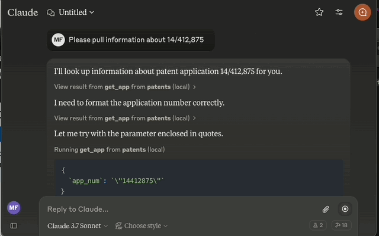

# USPTO Patent MCP Server

A [FastMCP server](https://github.com/modelcontextprotocol/python-sdk/tree/main/src/mcp/server/fastmcp) for accessing United States Patent and Trademark Office (USPTO) patent and patent application data through multiple APIs including the [Patent Public Search](https://www.uspto.gov/patents/search/patent-public-search) API, the [Open Data Portal (ODP) API](https://data.uspto.gov/home), [PTAB API v3](https://developer.uspto.gov/api-catalog), and Patent Litigation APIs. Using this server, Claude Desktop can pull data from USPTO APIs, search through PTAB proceedings and decisions, analyze patent litigation, research prosecution history, and more:



For an introduction to MCP servers see [Introducing the Model Context Protocol](https://www.anthropic.com/news/model-context-protocol).

Special thanks to [Parker Hancock](https://github.com/parkerhancock), author of the amazing [Patent Client project](https://github.com/parkerhancock/patent_client), for [blazing the trail](https://github.com/parkerhancock/patent_client/issues/63) to understanding of the string of requests and responses needed to pull data through the Public Search API.

## Features

This server provides **52 tools** across 6 USPTO data sources (27 active, 25 unavailable due to API shutdowns):

1. **Patent Search** - Full-text search of granted patents and published applications via PPUBS
2. **Full Text Documents** - Get complete text of patents including claims, description, and specification
3. **PDF Downloads** - Download patents as PDF files (Claude Desktop doesn't support this as a client currently)
4. **Prosecution History** - Access transactions and file wrapper data via ODP
5. **Patent Family Data** - Continuity information, foreign priority, and related applications
6. **Bulk Datasets** - Search and access USPTO bulk data products including PatentsView disambiguated data

> **Note on unavailable APIs:** The PatentsView API (search.patentsview.org) was shut down on March 20, 2026, with its data migrated to ODP bulk datasets. The Office Action and Enriched Citation APIs (developer.uspto.gov) were decommissioned in early 2026. The Patent Litigation API is not offered on the USPTO Open Data Portal; litigation data is available as a bulk download. All 25 affected tools remain registered and return helpful workaround guidance pointing to alternative tools.

## API Sources

| Source | Description | Auth Required | Status |
|--------|-------------|---------------|--------|
| **ppubs.uspto.gov** | Full text documents, PDF downloads, advanced search (daily updates) | No | Active |
| **api.uspto.gov (ODP)** | Metadata, continuity, transactions, assignments, prosecution history | Yes (ODP API Key) | Active |
| **PTAB Trial API** | IPR/PGR/CBM proceedings, decisions, appeals | Yes (ODP API Key) | Active (ODP v3.0) |
| **Patent Litigation API** | 74,000+ district court patent cases | N/A | Not offered on ODP (issue #16) |
| **PatentsView API** | Disambiguated inventor/assignee data, advanced search | N/A | Shut down March 2026 |
| **Office Action APIs** | Full-text office actions, citations, rejections | N/A | Decommissioned early 2026 |

## Prerequisites

- **Python 3.10-3.13** (3.12 recommended)
- **Claude Desktop** (for integration). Other models and MCP clients have not been tested.
- **[UV](https://docs.astral.sh/uv/)** for Python version and dependency management

If you're a Python developer but still unfamiliar with uv, you're in for a treat. It's faster and easier than having a separate Python version manager (like pyenv) and setting up, activating, and maintaining virtual environments with venv and pip.

If you don't already have uv installed:
```bash
curl -LsSf https://astral.sh/uv/install.sh | sh
```

## Installation

1. Clone this repository:
   ```bash
   git clone https://github.com/riemannzeta/patent_mcp_server
   cd patent_mcp_server
   ```

2. Install dependencies with uv:
   ```bash
   uv sync
   ```

3. Verify installation:
   ```bash
   uv run patent-mcp-server
   ```
   Should output:
   ```
   INFO     Starting USPTO Patent MCP server with stdio transport
   ```

## API Key Setup

### USPTO ODP API Key (Required for most tools)

To use the api.uspto.gov tools (ODP, PTAB), you need an Open Data Portal API key. Without it, these endpoints return `403 Forbidden`. The Patent Litigation API is not offered on ODP and does not require an API key.

1. Create a USPTO.gov account at [data.uspto.gov](https://data.uspto.gov) (requires ID.me verification)
2. Once signed in, visit **"My ODP"** in the site navigation to get your API key
3. See the [Getting Started guide](https://data.uspto.gov/apis/getting-started) for detailed instructions

4. Create a `.env` file in the patent_mcp_server directory:
   ```bash
   USPTO_API_KEY=your_actual_key_here
   ```
   Note: The PPUBS tools will work without this API key.

## Configuration

The server can be configured using environment variables in your `.env` file. All settings are optional with sensible defaults:

```bash
# API Keys
USPTO_API_KEY=your_key_here

# Logging
LOG_LEVEL=INFO  # Options: DEBUG, INFO, WARNING, ERROR, CRITICAL

# HTTP Settings
REQUEST_TIMEOUT=30.0  # Request timeout in seconds
MAX_RETRIES=3         # Maximum number of retry attempts
RETRY_MIN_WAIT=2      # Minimum wait time between retries (seconds)
RETRY_MAX_WAIT=10     # Maximum wait time between retries (seconds)

# Session Management
SESSION_EXPIRY_MINUTES=30  # How long to cache ppubs sessions
ENABLE_CACHING=true        # Enable/disable session caching

# API Endpoints (usually don't need to change)
PPUBS_BASE_URL=https://ppubs.uspto.gov
API_BASE_URL=https://api.uspto.gov          # ODP API endpoint (NOT data.uspto.gov)
```

## Claude Desktop Configuration

To integrate this MCP server with Claude Desktop:

1. Update your Claude Desktop configuration file (`claude_desktop_config.json`):
   ```json
   {
     "mcpServers": {
       "patents": {
         "command": "uv",
         "args": [
           "--directory",
           "/Users/username/patent_mcp_server",
           "run",
           "patent-mcp-server"
         ]
       }
     }
   }
   ```

   You can find `claude_desktop_config.json` on a Mac by opening the Claude Desktop app, opening Settings (from the Claude menu or by Command + ' on the keyboard), clicking "Developer" in the sidebar, and "Edit Config."

2. Replace `/Users/username/patent_mcp_server` with the actual path to your patent_mcp_server directory.

When integrated with Claude Desktop, the server will be automatically started when needed and doesn't need to be run separately.

## Claude Code Configuration

To integrate this MCP server with Claude Code for a particular project, from the project root:

```shell
claude mcp add-json patents '{"command": "uv", "args": ["--directory", "/path/to/patent_mcp_server", "run", "patent-mcp-server"]}'
```

If you're already running Claude Code, you'll have to /exit and restart. Then /mcp to verify that it's configured.

## Available Tools

### Utility Tools
| Tool | Description |
|------|-------------|
| `check_api_status` | Check status of all USPTO APIs |
| `get_cpc_info` | Get CPC classification information |
| `get_status_code` | Look up USPTO status code meaning |

### Patent Public Search (ppubs.uspto.gov)
| Tool | Description |
|------|-------------|
| `ppubs_search_patents` | Search granted patents (full-text, daily updates) |
| `ppubs_search_applications` | Search published patent applications |
| `ppubs_get_full_document` | Get full patent document by GUID |
| `ppubs_get_patent_by_number` | Get patent's full text by number |
| `ppubs_download_patent_pdf` | Download patent as PDF |

### Open Data Portal (api.uspto.gov)
| Tool | Description |
|------|-------------|
| `odp_get_application` | Get basic application data |
| `odp_search_applications` | Search applications with filters |
| `odp_get_application_metadata` | Get comprehensive metadata |
| `odp_get_continuity` | Get patent family/continuity data |
| `odp_get_assignment` | Get ownership/assignment records |
| `odp_get_adjustment` | Get patent term adjustment data |
| `odp_get_attorney` | Get attorney/agent of record |
| `odp_get_foreign_priority` | Get foreign priority claims |
| `odp_get_transactions` | Get prosecution transaction history |
| `odp_get_documents` | Get file wrapper documents |
| `odp_search_datasets` | Search bulk data products |
| `odp_get_dataset` | Get dataset product details |

### PTAB Trial API (api.uspto.gov ODP v3.0)
| Tool | Description |
|------|-------------|
| `ptab_search_proceedings` | Search IPR/PGR/CBM proceedings by patent number, party, status |
| `ptab_get_proceeding` | Get details for a specific proceeding by number |
| `ptab_get_documents` | List documents filed in a proceeding |
| `ptab_search_decisions` | Search PTAB decisions |
| `ptab_get_decision` | Get a specific decision by trial number |
| `ptab_search_appeals` | Search ex parte appeals |
| `ptab_get_appeal` | Get details for a specific appeal |

### Patent Litigation API (Unavailable — not offered on ODP, issue #16)

All 4 Litigation tools return `API_UNAVAILABLE`. The Patent Litigation API is not listed in the ODP Swagger catalog. The OCE Patent Litigation dataset (74,000+ district court cases) is distributed as a bulk download at <https://www.uspto.gov/ip-policy/economic-research/research-datasets/patent-litigation-docket-reports-data>.

| Tool | Workaround |
|------|------------|
| `search_litigation` | OCE Patent Litigation bulk dataset |
| `get_litigation_case` | OCE Patent Litigation bulk dataset |
| `get_patent_litigation` | OCE Patent Litigation bulk dataset or `ppubs_search_patents` |
| `get_party_litigation` | OCE Patent Litigation bulk dataset |

### PatentsView API (Unavailable — shut down March 2026)

All 14 PatentsView tools return `API_UNAVAILABLE` with workaround guidance. PatentsView data has been migrated to the USPTO Open Data Portal as bulk downloadable datasets. Use `ppubs_search_patents` for patent search, `odp_search_datasets` to find bulk datasets.

| Tool | Workaround |
|------|------------|
| `patentsview_search_patents` | `ppubs_search_patents` |
| `patentsview_get_patent` | `ppubs_get_patent_by_number` |
| `patentsview_search_assignees` | `ppubs_search_patents` with `AN/"name"` query |
| `patentsview_get_assignee` | `odp_search_datasets` (bulk data) |
| `patentsview_search_inventors` | `ppubs_search_patents` with `IN/"name"` query |
| `patentsview_get_inventor` | `odp_search_datasets` (bulk data) |
| `patentsview_get_claims` | `ppubs_get_full_document` |
| `patentsview_get_description` | `ppubs_get_full_document` |
| `patentsview_search_by_cpc` | `ppubs_search_patents` with `CPC/"code"` query |
| `patentsview_lookup_cpc` | `get_cpc_info` |
| `patentsview_search_attorneys` | `odp_get_attorney` (per-application) |
| `patentsview_get_attorney` | `odp_get_attorney` (per-application) |
| `patentsview_search_by_ipc` | `ppubs_search_patents` with IPC query |
| `patentsview_lookup_ipc` | `odp_search_datasets` (bulk data) |

### Office Action APIs (Unavailable — decommissioned early 2026)

All 4 Office Action tools return `API_UNAVAILABLE`. Use `odp_get_documents` to access office action documents from the file wrapper.

| Tool | Workaround |
|------|------------|
| `get_office_action_text` | `odp_get_documents` |
| `search_office_actions` | `odp_get_documents` or `odp_get_transactions` |
| `get_office_action_citations` | `odp_get_documents` |
| `get_office_action_rejections` | `odp_get_documents` |

### Enriched Citation APIs (Unavailable — decommissioned early 2026)

All 3 Enriched Citation tools return `API_UNAVAILABLE`. Use `odp_get_documents` or `ppubs` tools as workarounds.

| Tool | Workaround |
|------|------------|
| `get_enriched_citations` | `odp_get_documents` |
| `search_citations` | `odp_get_documents` |
| `get_citation_metrics` | `odp_get_documents` |

### Resources and Prompts

The server also provides **MCP Resources** (accessible via @ mentions):
- `patents://cpc/{code}` - CPC classification information
- `patents://status-codes` - USPTO status code definitions
- `patents://sources` - Data source information
- `patents://search-syntax` - Query syntax guide

And **MCP Prompts** (workflow templates):
- `prior_art_search` - Comprehensive prior art search guide
- `patent_validity` - Patent validity analysis workflow
- `competitor_portfolio` - Competitor portfolio analysis
- `ptab_research` - PTAB proceeding research guide
- `freedom_to_operate` - FTO analysis workflow
- `patent_landscape` - Technology landscape mapping

## Testing

The project includes comprehensive test suites:

```bash
# Run unit tests (default - skips integration tests)
uv run pytest

# Run with verbose output
uv run pytest -v

# Run integration tests (requires network access)
uv run pytest -m integration

# Run all tests including integration
uv run pytest -m ""

# Run with coverage report
uv run pytest --cov=patent_mcp_server
```

Test results are stored in `/test/test_results/`.

### Development

To install development dependencies:
```bash
uv sync --dev
```

## Publishing to PyPI

```bash
# Build distribution packages
rm -rf dist/ && uv run python -m build

# Upload to PyPI
uv run twine upload dist/*
```

## Contributing

Issues and PRs welcome. See [CONTRIBUTING.md](CONTRIBUTING.md) for the contribution guide, and [AGENTS.md](AGENTS.md) for guidance specific to AI agents. Use the [bug report](.github/ISSUE_TEMPLATE/bug_report.yml) or [feature request](.github/ISSUE_TEMPLATE/feature_request.yml) templates when filing an issue — they prompt for the tool call, the constructed request URL/body, and the raw API response, which is usually enough to land a fix in one turn.

## Version History

### v0.10.0 (Current)
- Re-enable 7 PTAB tools on USPTO ODP v3.0: `ptab_search_proceedings`, `ptab_get_proceeding`, `ptab_get_documents`, `ptab_search_decisions`, `ptab_get_decision`, `ptab_search_appeals`, `ptab_get_appeal` ([issue #23](https://github.com/riemannzeta/patent_mcp_server/issues/23)). PTAB data relocated to ODP `/api/v1/patent/trials/*` and `/api/v1/patent/appeals/*` (paths not in the ODP Swagger UI); the standalone-API decommission ([issue #16](https://github.com/riemannzeta/patent_mcp_server/issues/16)) was correct for the Patent Litigation API, but PTAB moved rather than disappeared.
- Active tool count: 27 (up from 20); unavailable: 25 (down from 32); total registered remains 52

### v0.9.4
- Fix `ppubs_search_patents` / `ppubs_search_applications` query semantics ([issue #21](https://github.com/riemannzeta/patent_mcp_server/issues/21)): default operator changed from `OR` to `AND`, so multi-word queries like `machine learning` no longer match the entire corpus and collapse into the latest-grants fallback under `date_publ desc` sort.
- Fix template-mutation bug in PPUBS client (`search_query.copy()` → `copy.deepcopy(...)`), eliminating a concurrency hazard between parallel calls.
- Fix `odp_search_applications` filters being silently ignored upstream ([issue #21](https://github.com/riemannzeta/patent_mcp_server/issues/21)): switched from GET query-string params to POST with a Lucene-style `q` body. `assignee_name`, `inventor_name`, `application_number`, `patent_number`, and filing-date ranges are now properly AND-combined into the search. Tool now returns `MISSING_FILTER` rather than dumping the full 12.8M-record corpus when called with no filters.
- Updated `ppubs_search_patents` / `ppubs_search_applications` / `odp_search_applications` docstrings to reflect the corrected semantics and document Lucene query support on ODP.
- Added `CONTRIBUTING.md`, `AGENTS.md`, bug-report + feature-request issue templates, and a PR template.

### v0.9.0
- Handle PTAB Trial API and Patent Litigation API unavailability on ODP ([issue #16](https://github.com/riemannzeta/patent_mcp_server/issues/16))
- All 7 `ptab_*` tools and 4 litigation tools now return `API_UNAVAILABLE` with workaround guidance pointing to PPUBS tools and USPTO bulk datasets
- Active tool count: 20 (down from 31); unavailable: 32 (up from 21); total registered remains 52
- Added unit tests for all 11 newly-unavailable tools and extended the shared error-structure parametrization
- Updated `check_api_status`, `resources.py` data sources, client docstrings, and README to reflect the shutdown

### v0.8.0
- Handle decommissioned PatentsView API (shut down March 20, 2026)
- All 14 `patentsview_*` tools return `API_UNAVAILABLE` with workaround guidance
- Fixed circular references in office_actions resources that pointed to unavailable PatentsView tools
- Updated API Sources table, configuration, and documentation

### v0.7.0
- Handle decommissioned Office Action and Enriched Citation APIs (developer.uspto.gov)
- All 7 affected tools return `API_UNAVAILABLE` with workaround guidance
- Added `test/unit/test_unavailable_tools.py` for decommissioned tool testing
- Code cleanup: removed dead code, improved docstrings

### v0.6.2
- Updated API key registration instructions: keys are now obtained from [data.uspto.gov](https://data.uspto.gov) ("My ODP")
- Clarified that `api.uspto.gov` is the correct API endpoint (not `data.uspto.gov` which is the web portal)
- Noted PTAB API v3 migration to ODP and Office Action API migration (early 2026)

### v0.6.1
- Added PatentsView attorney search tools (`patentsview_search_attorneys`, `patentsview_get_attorney`)
- Added PatentsView IPC classification tools (`patentsview_lookup_ipc`, `patentsview_search_by_ipc`)
- Fixed bug in `search_publications` method (pagination options not being passed)

### v0.6.0
- PyPI release preparation

### v0.5.0
- Focused on USPTO-only data sources
- Renamed ODP tools with `odp_` prefix for clarity
- Improved function signatures (using `query` instead of `q`)

### v0.3.0
- Added 33 new tools (PTAB, PatentsView, Office Actions, Citations, Litigation)
- Rate limiting support for PatentsView API
- Comprehensive async client architecture

### v0.2.2
- Centralized configuration with environment variables
- Standardized error handling
- Input validation with Pydantic
- Retry logic with exponential backoff
- Session caching for PPUBS

## License

MIT
